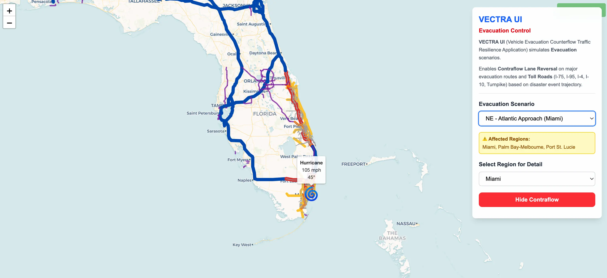

# Vectra UI - Vehicle Evacuation Counterflow Traffic Resilience Application

## Overview
Vectra UI is a Next.js application designed to simulate and visualize evacuation traffic scenarios, specifically focusing on Contraflow Lane Reversal on Florida's major highways.



## Key Features
-   **Interactive Map**: Leaflet-based visualization of road networks.
-   **Contraflow Simulation**: Dynamic rendering of road directions based on evacuation scenarios.
-   **Real-time Health Monitoring**: Continuous system checks (Redis + Backend) with automated maintenance mode.
-   **Resilience**: Graceful degradation when backend services are unavailable.

## Setup & Testing

### Prerequisites
-   Node.js (v18+)
-   Redis (running on localhost:6379)
-   Backend Service (running on port 8000)

### Installation
```bash
npm install
```

### Running Development Server
```bash
npm run dev
# Runs on localhost:3000 (default)
```

### Running Tests
The project uses **Jest** and **React Testing Library**.

```bash
# Run all tests
npm test

# Run tests in watch mode
npm run test:watch

# Generate coverage report
npm run test:coverage
```

### Docker Deployment

#### Build Docker Image
```bash
# Build the Docker image locally (for development)
docker build -t vectra-ui:latest .
```

#### Run with Docker Compose
The application is configured to run with Docker Compose alongside backend services:

```bash
# Start all services (frontend, backend, Redis, PostgreSQL)
docker compose up -d

# View logs
docker compose logs -f frontend

# Stop all services
docker compose down
```

#### Docker Configuration
- **Image**: `ghcr.io/eltifi/vectra-ui:latest`
- **Port**: `3000`
- **Dependencies**: 
  - Redis (cache) - `redis:alpine`
  - Backend API - `ghcr.io/eltifi/vectra:latest`
  - PostgreSQL - `pgrouting/pgrouting:16-3.5-3.7`

The docker compose.yml includes health checks and automatic service orchestration.

## Documentation Standards
-   All files include TSDoc/JSDoc headers.